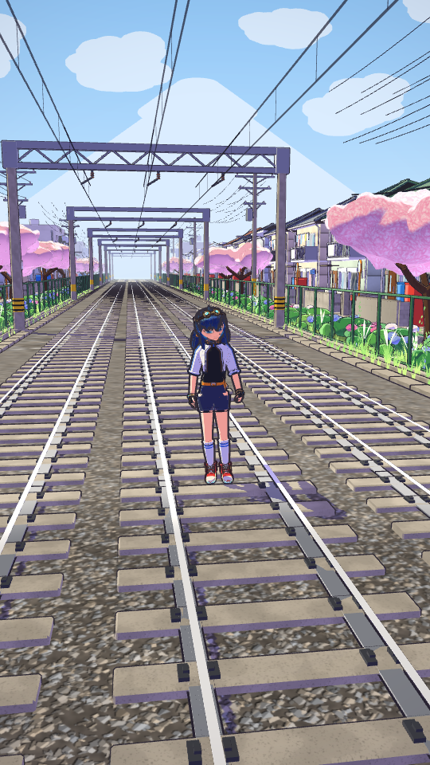
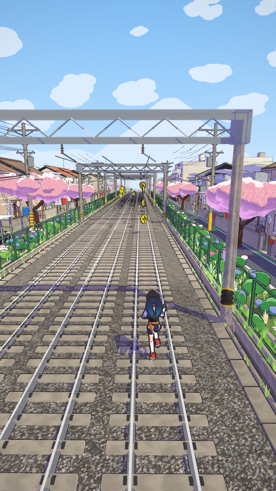
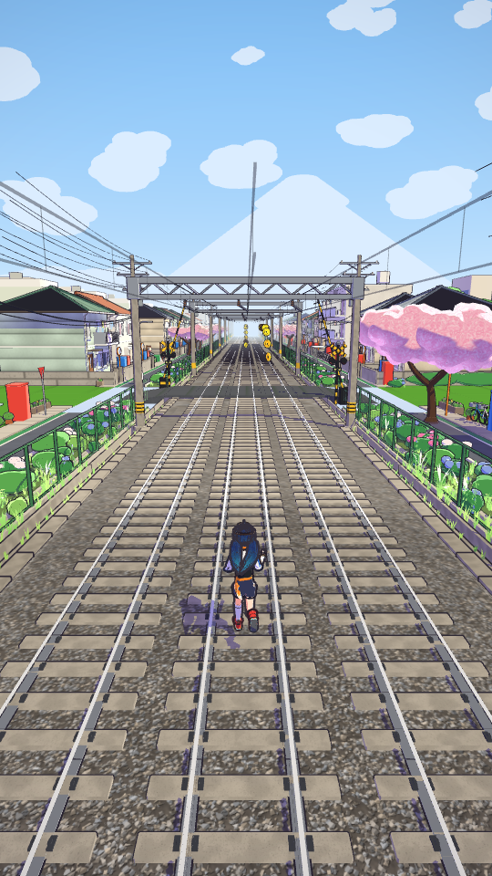
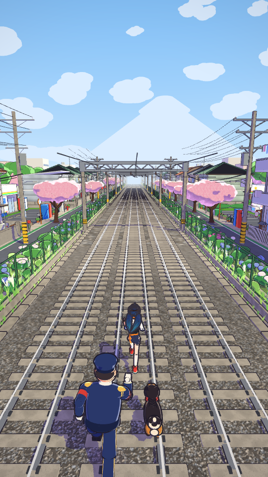
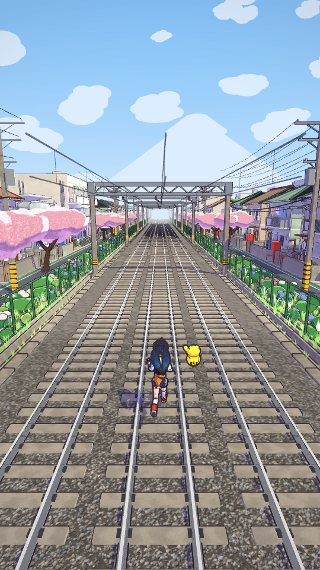

# Endless Rush

A 3D endless runner for Android in the style of subway-runner games. Everything is original and generated in code: the 3D models, the city, the characters, the sound effects and the music. There are no downloaded assets, no game engine and no Gradle.

**Download:** [`dist/EndlessRush.apk`](dist/EndlessRush.apk). Sideload it on Android 5.0 or newer; you may need to allow "Install unknown apps".

| Title | The Sakura Line | Level crossing | Chased |
|---|---|---|---|
|  |  |  |  |

## Features

- **3 lanes, swipe controls.** Left/right to switch lanes, up to jump, down to roll. Swiping down in mid-air slams you to the ground. Arrow keys and WASD also work, with B for the hoverboard.
- **Obstacles.** Parked trains, **oncoming moving trains**, ramps that take you onto train roofs, low barriers (jump), high barriers (roll) and signal blocks (dodge sideways).
- **Stumble and chase.** Clipping the side of a train makes you stumble, and the inspector and his dog close in. Stumble again before they drop back and you're caught. Hitting something head-on ends the run.
- **Coins** in lines, in arcs over barriers, up ramps and along train roofs.
- **Power-ups:** Hayate Rocket (fly over everything and collect sky coins), Tobi Boots (jump high enough to reach train roofs), Maneki Magnet (a golden lucky cat pulls the coins in) and the Fever Star (2X score).
- **Kaze Boards.** Double-tap to ride one. It lasts 30 s and absorbs one crash.
- **Omamori and Save Me.** When you crash you can spend omamori charms to keep going. The cost doubles each time you revive in a run.
- **Gacha capsules** on the track and in the shop.
- **Missions.** Three missions are active at a time (coins, jumps, rolls, score, dodging trains and more). Finishing a set raises your permanent **score multiplier**, up to x30.
- **Shop.** Six upgrade levels for each power-up, plus Kaze Boards, omamori and gacha capsules.
- **Pongo**, the cel-shaded heroine from the [PONGO rework](docs/PONGO_DESIGN.md): a skinned, animated Blender model with ink outlines and spring-physics twin tails, chased by Inspector Daigo and his shiba Kuro.
- **The Sakura Line art style everywhere.** Flat cel shading with violet-tinted shadows, thin ink outlines, soft pastel materials and dense small detail: the town, trains, obstacles, pickups, chasers, the greenery that covers every verge and garden, the cloud-filled sky, and the cream-paper menus and HUD. Everything is modelled in Blender scripts (`blender/`) and drawn by the `com.pongo` toon renderer.
- The game speeds up the longer you run, and the level generator makes sure there is always a way through.
- Pause with a 3-2-1 resume countdown, a high score, and progress saved on the device.
- Synthesized music and sound effects, each of which can be turned on or off.

## Code layout

```
src/com/endlessrush/core/   pure Java: game logic, level generator, camera, SakuraWorld (lays out the line) (no Android deps)
src/com/endlessrush/app/    Android: GL surface, audio mixer/synth, UI screens, touch input
src/com/pongo/core/         toon renderer data: pongo.bin loader, skeletal animator, GLSL, RenderFrame
src/com/pongo/app/          Android GLES 2.0 executor for RenderFrames (shadow map, cel shading, outlines, decals)
assets/pongo.bin            every mesh, skeleton, clip and the texture atlas, built from blender/ by tools/build_assets.sh
assets/fonts/               Outfit Bold, the UI typeface (SIL Open Font License)
tools/Preview.java          headless bot simulations (preview.sh sim)
tools/preview/, tools/web/  GLES recorder + WebGL replayer: runs the real Android renderers headless (preview.sh sakura)
tools/icon/                 composes the launcher icon from Pongo's Blender render
```



## Build

```bash
sudo apt-get install aapt apksigner zipalign dalvik-exchange android-sdk-platform-23 openjdk-17-jdk
./build.sh            # -> dist/EndlessRush.apk
./preview.sh sim 20   # 20 headless autopilot runs to sanity-check level generation
./preview.sh sakura   # the real Android renderers replayed in headless Chromium -> preview/sakura_*.png
./preview.sh zones    # a run through the tunnel into the Crystal Cavern and back -> preview/zone_*.png
tools/build_assets.sh # rebuild assets/pongo.bin from the Blender scripts (Blender 4.0 + numpy)
node tools/icon/make_icon.mjs  # launcher icons from renders/design/icon_bust.png (blender ui_icon render_icon_bust)
```

`build.sh` creates a debug signing key in `keystore/` the first time it runs; this folder is git-ignored. Keep the same key if you want new builds to install as updates over old ones.
