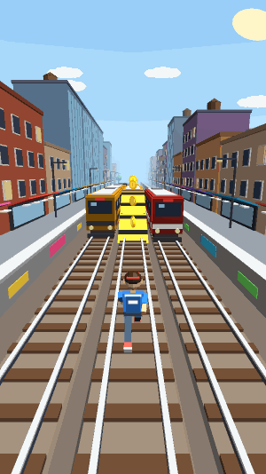
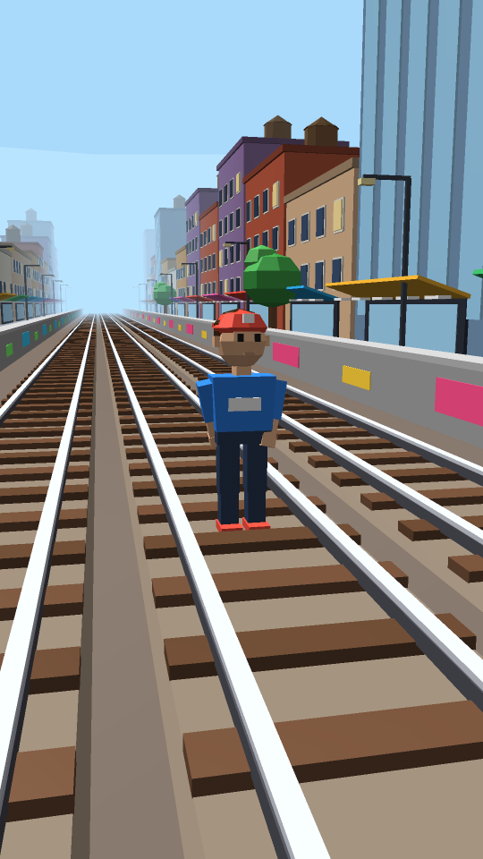
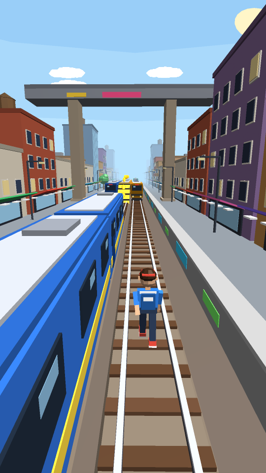
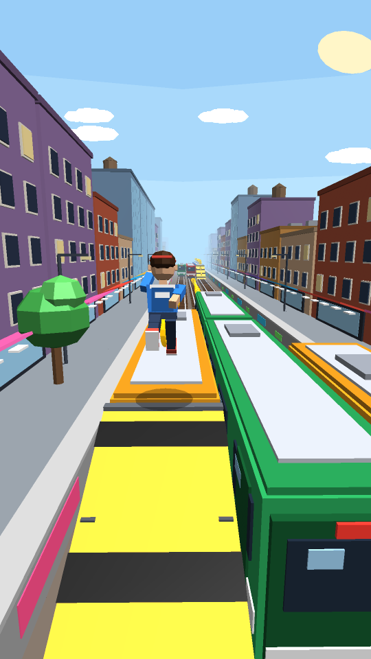
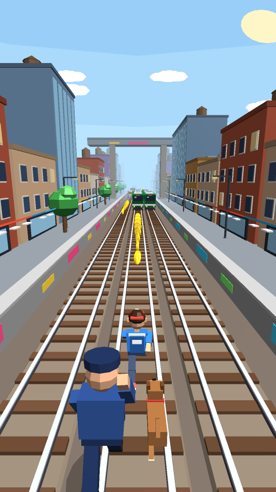
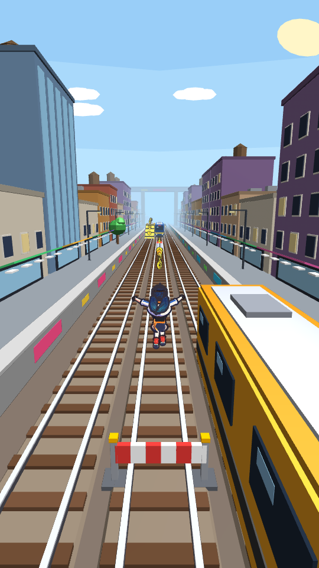

# Endless Rush

A 3D endless runner for Android in the style of subway-runner games. Everything is original and generated in code: the 3D models, the city, the characters, the sound effects and the music. There are no downloaded assets, no game engine and no Gradle.

**Download:** [`dist/EndlessRush.apk`](dist/EndlessRush.apk). Sideload it on Android 5.0 or newer; you may need to allow "Install unknown apps".



| Menu | Running | Train roofs | Chased |
|---|---|---|---|
|  |  |  |  |

## Features

- **3 lanes, swipe controls.** Left/right to switch lanes, up to jump, down to roll. Swiping down in mid-air slams you to the ground. Arrow keys and WASD also work, with B for the hoverboard.
- **Obstacles.** Parked trains, **oncoming moving trains**, ramps that take you onto train roofs, low barriers (jump), high barriers (roll) and signal blocks (dodge sideways).
- **Stumble and chase.** Clipping the side of a train makes you stumble, and the inspector and his dog close in. Stumble again before they drop back and you're caught. Hitting something head-on ends the run.
- **Coins** in lines, in arcs over barriers, up ramps and along train roofs.
- **Power-ups:** Jetpack (fly over everything and collect sky coins), Super Sneakers (jump high enough to reach train roofs), Coin Magnet and 2X Multiplier.
- **Hoverboards.** Double-tap to use one. It lasts 30 s and absorbs one crash.
- **Keys and Save Me.** When you crash you can spend keys to keep going. The cost doubles each time you revive in a run.
- **Mystery boxes** on the track and in the shop.
- **Missions.** Three missions are active at a time (coins, jumps, rolls, score, dodging trains and more). Finishing a set raises your permanent **score multiplier**, up to x30.
- **Shop.** Six upgrade levels for each power-up, plus hoverboards, keys and mystery boxes.
- **Heroes.** Five original characters: Pongo (free), Nova, Rook, Mika and Bolt-9.
- **Pongo toon layer.** The starter hero is Pongo, the cel-shaded heroine from the [PONGO rework](docs/PONGO_DESIGN.md): a skinned, animated Blender model with ink outlines, spring-physics twin tails, and toon-shaded Mon coins, drawn over the Sakura Line world by the `com.pongo` renderer.
- The game speeds up the longer you run, and the level generator makes sure there is always a way through.
- Pause with a 3-2-1 resume countdown, a high score, and progress saved on the device.
- Synthesized music and sound effects, each of which can be turned on or off.

## Code layout

```
src/com/endlessrush/core/   pure Java: game logic, level generator, 3D models, scene/camera (no Android deps)
src/com/endlessrush/app/    Android: GLES 2.0 renderer, audio mixer/synth, UI screens, touch input
src/com/pongo/core/         toon renderer data: pongo.bin loader, skeletal animator, GLSL, RenderFrame
src/com/pongo/app/          Android GLES 2.0 executor for RenderFrames (shadow map, cel shading, outlines, decals)
assets/pongo.bin            Pongo + coin meshes, skeleton, clips and atlas, built from blender/ by tools/build_assets.sh
tools/Preview.java          desktop software rasteriser that renders the same scenes to PNG/GIF + bot simulations
tools/preview/, tools/web/  GLES recorder + WebGL replayer: runs the real Android renderers headless (preview.sh pongo)
```



## Build

```bash
sudo apt-get install aapt apksigner zipalign dalvik-exchange android-sdk-platform-23 openjdk-17-jdk
./build.sh            # -> dist/EndlessRush.apk
./preview.sh          # screenshots -> preview/
./preview.sh gif      # animated gameplay -> preview/gameplay.gif
./preview.sh sim 20   # 20 headless autopilot runs to sanity-check level generation
./preview.sh icon     # regenerate launcher icons
./preview.sh pongo    # the real Android renderers replayed in headless Chromium -> preview/pongo_*.png
tools/build_assets.sh # rebuild assets/pongo.bin from the Blender scripts (Blender 4.0 + numpy)
```

`build.sh` creates a debug signing key in `keystore/` the first time it runs; this folder is git-ignored. Keep the same key if you want new builds to install as updates over old ones.
